# 🌐 Tochir Plast — Corporate Website for a Plastic Product Manufacturer

**Tojir Plast LLC** is the leading manufacturer of plastic barrels and containers in Tajikistan.  
This responsive corporate website was developed from scratch using Django. It includes a product catalog with advanced filtering, image galleries, order forms, and full mobile support.

## 🔗 Live Repository

👉 https://github.com/JahongirM98/tojir_plast

---

## 📌 Key Features

- 🛒 Product catalog with filters by volume, shape, and layer
- 🖼 Product pages with image galleries and thumbnails
- 📝 Order form on each product page
- 🏭 "About Us" page with company history and image sliders
- 📞 Contact page with feedback form and Google Maps integration
- 📱 Fully responsive layout for mobile and desktop
- 🔍 Product search by name or volume
- 🌤 Sidebar with weekly weather and calendar widget

---

## 🧰 Tech Stack

- **Backend**: Django
- **Frontend**: Bootstrap 5, HTML5, CSS3
- **Icons**: Bootstrap Icons
- **Animations**: AOS (Animate on Scroll)
- **Image Management**: Django `ImageField` + media/
- **Template Engine**: Django Templates

---

## 📷 Screenshots

### 💻 Desktop View

| Home | Popular Models | Certificates |
|------|----------------|--------------|
| 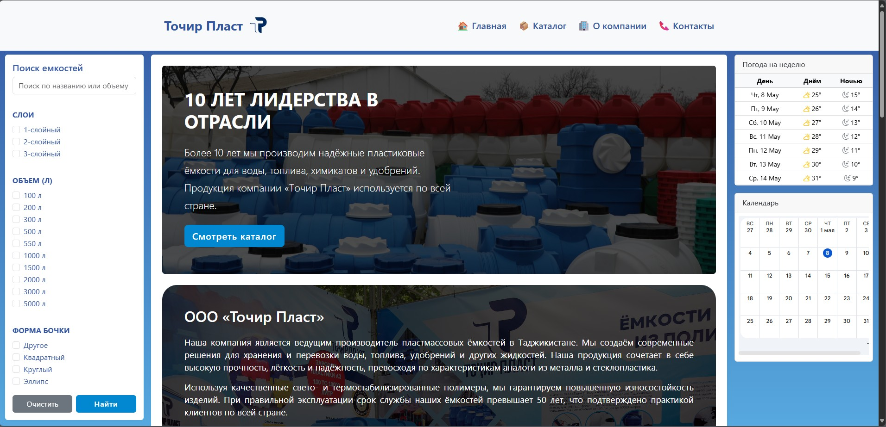 | 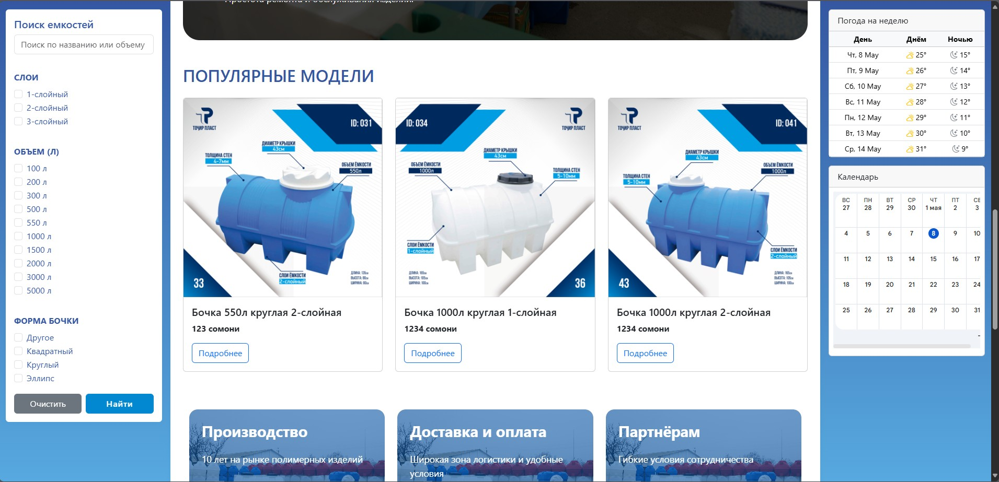 | 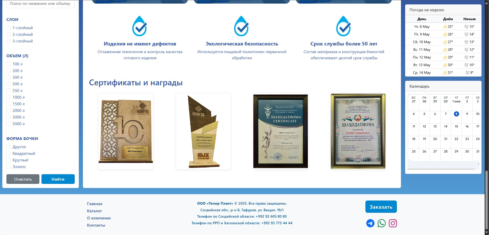 |

| Catalog | About Us | Contact |
|---------|----------|---------|
| 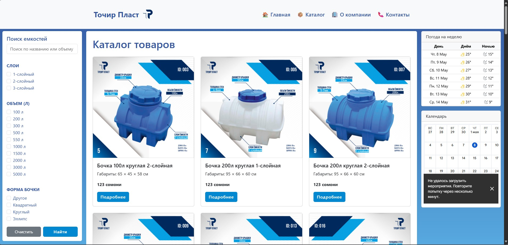 | 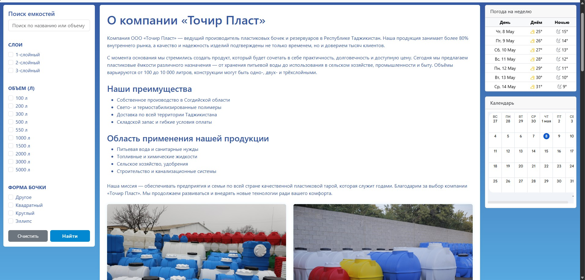 | 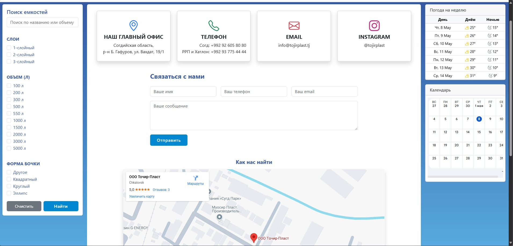 |

---

### 📱 Mobile View

| Home | Catalog |
|------|---------|
| 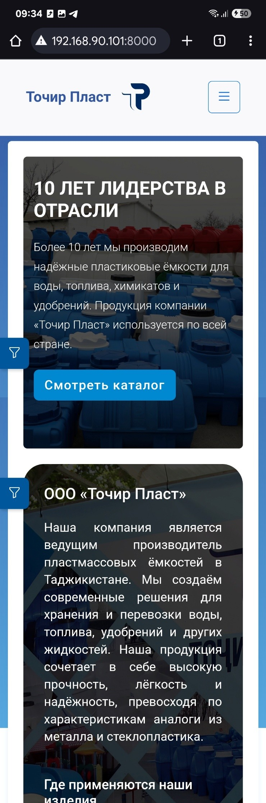 | 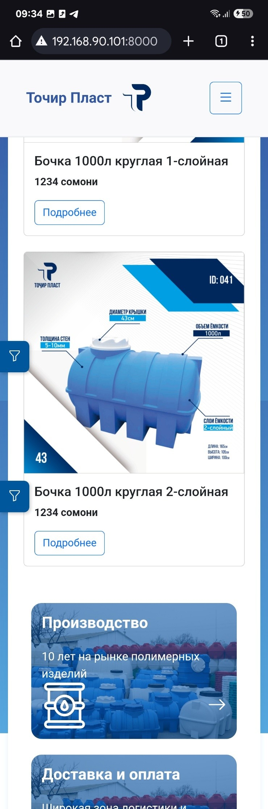 |

| Menu | Product | About | Contact |
|------|---------|-------|---------|
| 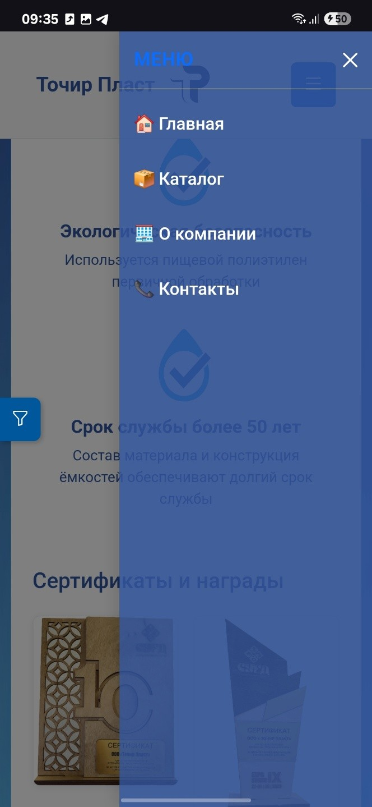 | 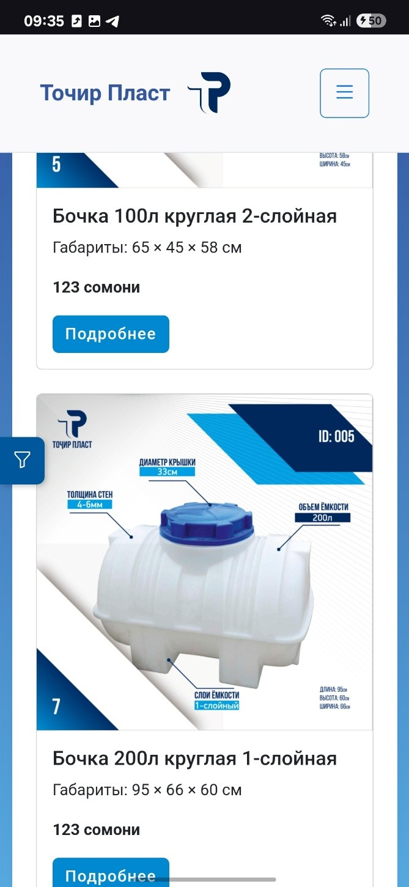 | 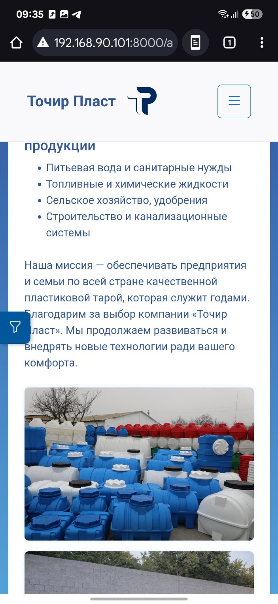 | 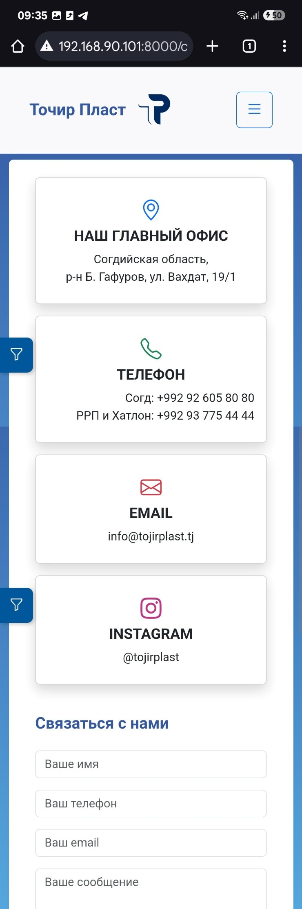 |


---

## 📄 License

This project is open-source and intended for portfolio and educational purposes only.  
All branding, trademarks, and company-related visuals associated with "Tojir Plast" belong to the company and may not be used commercially.  
For any commercial use or reproduction, please contact the author.

---

## ⚙️ Getting Started (Local Setup)

```bash
# Clone the repository
git clone https://github.com/JahongirM98/tojir_plast.git
cd tojir_plast

# Install dependencies (if needed)
pip install -r requirements.txt

# Run migrations
python manage.py migrate

# Start the development server
python manage.py runserver


